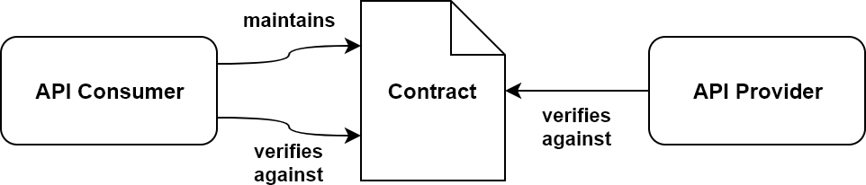

# Consumer Driven Contracts

### The Problem - Integration Test Hell
Each service in a distributed system potentially communicates with a set of other services within or even beyond that system. This communication hopefully takes place through well-defined APIs that are stable between releases.

To validate that the communication between a consumer and a provider of an API still works as intended after some code changes were made, the common reflex is to **setup integration tests**. So, for each combination of an API provider and consumer, we write one or more integration tests. For the integration tests to run automatically, we then have to deploy the provider service to an integration environment and then run the consumer application against its API. As if that is not challenging enough, the provider service may have some runtime dependencies that also have to be deployed, which have their own dependencies and soon you have the entire distributed system deployed for your integration tests.

This may be fine if your release schedule only contains a couple releases per year. **But if you want to release each service often and independently (i.e. you want to practice continuous delivery) this integration testing strategy does not suffice.**

To enable continuous delivery we have to **decouple the integration tests from an actual runtime test environment**. This is where consumer-driven contracts come into play.

### Consumer-Driven Contracts
* The idea behind consumer-driven contracts is to define a contract between each consumer/provider pair and then test the consumer and provider against that contract independently to verify that they abide by the contract. **This way each “integration test” can run separately and without a full-blown runtime test environment**.

* **The contract lies in the responsibility of the consumer**, hence the name “consumer-driven”. 
For example, the consumer defines a set of requests with expected responses within a contract. This way, **the provider knows exactly which API calls are actually used out there in the wild and unused APIs can safely be removed from the code base**.

Of course, the contract is created by the consumer in agreement with the provider so that it cannot define API calls the provider doesn’t want to support.

Consumer-Driven-Contracts
The consumer creates and maintains a contract. Both the consumer and provider verify against that contract with every change in their code base.
#### The process of consumer-driven contracts looks like this:

1. The API consumer creates and maintains a contract (in agreement with the provider).
2. The API consumer verifies that it successfully runs against the contract.
3. The API consumer publishes the contract.
4. The API provider verifies that it successfully runs against the contract.

##
* [Spring Cloud Contract](docs/Spring-Cloud-Contract.md)
* [Pact](docs/Spring-Cloud-Contract.md)

## Resources
* [Spring Cloud Contract](https://spring.io/projects/spring-cloud-contract) - good for presentation
* [Baeldung - An Intro to Spring Cloud Contract](https://www.baeldung.com/spring-cloud-contract)
* [All Examples](https://github.com/spring-cloud-samples/spring-cloud-contract-samples)
* [Spring Cloud Contract Workshops](https://github.com/spring-cloud-samples/spring-cloud-contract-samples/blob/master/docs/workshops.adoc)
* [Consumer-Driven Contracts with Pact, Feign and Spring Data REST](https://reflectoring.io/consumer-driven-contracts-with-pact-feign-spring-data-rest/)

  

